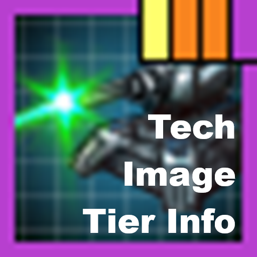

# Tech Image Tier Info



This project reads game files and generate a mod which overwrite thumbnails to
make it easier to understand the tech tree.

## Requirements

- Node.js 20 or newer.
- npm.
- ImageMagick 7 with DDS support and the `magick` command available on `PATH`.
- A local Stellaris installation.

The project and commands work from Bash, including Git Bash on Windows. Paths in
`config.json` use forward slashes.

## Setup

From this directory:

```bash
npm install
```

Check `gamePath` in `config.json`. It currently points to this computer's
detected Steam installation:

```text
C:/SteamLibrary/steamapps/common/Stellaris
```

## Build the mod

`build` will generate a tech_image_tier_info.mod file and a
tech_image_tier_info folder containign the mod contents. You can copy these into
your Documents\Paradox Interactive\Stellaris\mod folder to use the generated
mod.

```bash
npm run build
```

For quick visual iteration, regenerate only the selected PNG samples:

```bash
npm run sample
```

This fast path still reads the current technology definitions so borders and
successor bars remain accurate, but converts only the seven selected icons. It
does not rebuild DDS files, replace the rest of the mod, update the descriptor
or report, or create a ZIP backup.

To use a different configuration file:

```bash
npm run build -- /absolute/path/to/config.json
```

The sample-only command accepts the same optional configuration path:

```bash
npm run sample -- /absolute/path/to/config.json
```

## Configuration

`config.json` contains a bunch of options for generating boarders/bars/dots

`"importantTechnologies"` lets you add certain techs which will give all
prerequisits a dot of the defined color.
